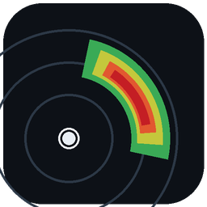

<p align="center">
  
</p>

<h1 align="center">BowEcho</h1>

<p align="center"><b>A fast, free, native NEXRAD Level II radar viewer.</b><br>
Live super-resolution base data, dealiased velocity, dual-pol, derived severe-weather
products, synced multi-pane, and vertical cross-sections — in a single small download.</p>

---

BowEcho decodes raw NEXRAD Level II data straight from the public AWS archive
and live chunk feed (no account, no API key) and renders it with a fast
CPU rasterizer that preserves the native super-resolution pixel pattern.
It is built in Rust for speed: products switch instantly, panning stays fluid,
and first pixels from a fresh volume arrive in well under a second on typical
connections.

## Download

Grab the latest build from the **[Releases](../../releases)** page:

| Platform | File |
|---|---|
| Windows x64 | `bowecho-windows-x64.zip` |
| Windows ARM64 | `bowecho-windows-arm64.zip` |
| macOS Apple Silicon | `bowecho-macos-apple-silicon.zip` |
| macOS Intel | `bowecho-macos-intel.zip` |
| Linux x64 | `bowecho-linux-x64.tar.gz` |
| Linux ARM64 | `bowecho-linux-arm64.tar.gz` |

**Windows:** unzip and run `bowecho.exe` — that's it. The exe is fully
self-contained (no installer, no runtime dependencies). Builds are not yet
code-signed, so SmartScreen may show "Windows protected your PC" the first
time: click **More info → Run anyway**.

> **Antivirus false positives.** Windows Defender's machine-learning
> heuristics sometimes flag new, unsigned Rust executables with names like
> `Trojan:Script/Sabsik.fl.A!ml` or `Wacatac.B!ml` — the `!ml` suffix means
> "ML guess", not a matched virus signature, and it's a well-known false
> positive for freshly compiled open-source binaries. Every BowEcho release
> is built by GitHub Actions directly from the tagged source in this
> repository (the full build log is public under the Actions tab), and each
> asset ships with a `.sha256` checksum so you can verify your download is
> byte-identical to what CI produced:
> `Get-FileHash bowecho-windows-x64.zip` (PowerShell) and compare. If
> Defender quarantines it, restore + add an exclusion, or report the false
> positive to Microsoft at
> <https://www.microsoft.com/en-us/wdsi/filesubmission> — developer
> submissions of `!ml` detections are typically cleared within days. You
> can always audit and build from source instead (see below).

**macOS:** unzip and open `BowEcho.app`. Unsigned for now — right-click the
app and choose **Open** the first time (or run
`xattr -d com.apple.quarantine BowEcho.app` in Terminal).

**Linux:** untar and run `./bowecho` (needs X11/Wayland + OpenGL, standard on
desktops).

## Quick start (storm mode)

1. Launch BowEcho. Pick a radar site from the sidebar (or right-click any site
   marker on the map) — the latest volume loads automatically.
2. The **LIVE** chip means auto-refresh is on; new volumes stream in as the
   radar scans. **ARCHIVE/STALE** chips tell you when you're not looking at
   current data.
3. Arrow keys: **←/→** cycle products, **↑/↓** change tilt. Scroll to zoom,
   drag to pan.
4. **Quad view:** sidebar → Layout **4** for synced REF / VEL / CC / ZDR.
   Click any pane to focus it (blue border), then the sidebar or arrow keys
   retune *that* pane — its own product and a pinned tilt. The main
   (top-left) pane drives everything that isn't pinned.
5. **Inspector:** hover for the data card (value, range/azimuth, beam height,
   Vrot). **Shift+click** pins it to a spot — it sticks through pan/zoom and
   updates every volume. Velocity products draw an inbound/outbound arrow.
6. **Cross-section:** tick *Cross-section* in the sidebar, click two points,
   and a vertical slice (RHI) renders below the map — reflectivity, or
   dealiased velocity when a velocity product is selected.
7. **Declutter:** *Hide below* applies a render-time threshold (on velocity it
   clamps |v|, so couplets pop while the noise around zero disappears).

## Products

**Base / dual-pol:** Reflectivity, Velocity (with region-based dealiasing),
Storm-relative velocity, Spectrum Width, ZDR, CC (ρhv), PHI, KDP — each with a
purpose-built color table (plus GR2-style presets, user-imported `.pal`
tables, and a colorblind-safe velocity option).

**Derived:** Composite Reflectivity, Echo Tops, VIL, VIL Density, Azimuthal
Shear (LLSD rotation), Radial Divergence — computed volume-locally in tens of
milliseconds and selectable like any product.

**Storm analysis:** NSSL-style mesocyclone/TVS detection (Stumpf et al.
1998; Mitchell et al. 1998) with time-association (CPLT → MESO), SCIT storm
cell tracks with motion extrapolation (Johnson et al. 1998), maximum expected
hail size (Witt et al. 1998), live draggable cross-sections, and GRLevelX
placefiles (icon sheets, Object blocks, auto-refresh).

**Velocity dealiasing** offers two engines: region-based unfolding
(Jing & Wiener 1993; Feldmann et al. 2020) — validated on real derecho data
at 99% residual-fold reduction — and an experimental tilt-cascade engine that
branch-checks each tilt against the wind fit from the tilt above
(Browning & Wexler 1968; Louf et al. 2020). Raw-velocity mode always carries
a "folds possible" tag plus near-Nyquist warnings in the inspector. The
algorithms and their references are documented in
[docs/products-guide.md](docs/products-guide.md).

**Display:** 1/2/4-pane synced grids with per-pane products and honest
per-pane readouts, optional GR2-style smoothing (zero panning cost), and an
azimuthal-equidistant projection so range and azimuth are true at every
latitude.

## Why it's fast

- Native Rust, lean CPU rasterizer, full quality at every zoom.
- Parallel block-bzip decompression pipelined with parsing — first pixels in
  tens of milliseconds once data arrives.
- One bounded render worker serves every pane (no thread oversubscription),
  with keyed moment/sample caches shared across panes.
- View-pure geometry (basemap projection, hazard tessellation) is cached per
  view, so idle repaints cost almost nothing.
- Honest stage timings in the status bar: lookup, fetch, decode, render,
  texture, cache.

## Data & hazards

- NEXRAD Level II from the public `unidata-nexrad-level2` S3 archive and the
  real-time chunk feed. No keys, no accounts, no middleman servers.
- Live NWS warnings/advisories and SPC mesoscale discussions overlay as
  clickable polygons with product-aware fills.
- Multi-radar overlays: load neighboring sites on the same map with
  independent refresh, opacity, and visibility.
- Mobile/research radars: open DOW, COW, and RaXPol data natively — DORADE
  sweepfiles and deployment zips decode straight to the map (transition-ray
  filtering, staggered-PRT Nyquist, CFAC corrections), and a GR2A-style
  polling URL follows field feeds live. When a FARM facility radar is
  deployed and plotting, BowEcho lights a LIVE chip and plays the quicklook
  loop (quicklooks courtesy of the FARM facility).

## Build from source

```sh
git clone https://github.com/FahrenheitResearch/bowecho
cd bowecho
cargo run --release -p app_ui --bin bowecho
```

Rust stable (edition 2024). Linux needs `pkg-config libgl1-mesa-dev libx11-dev
libxi-dev libxkbcommon-dev`.

## Disclaimer

BowEcho is an enthusiast/analyst tool, **not a warning service**. Never use it
as a substitute for official National Weather Service warnings and guidance.
During severe weather, follow your local NWS office and emergency management.

## Credits

- Annotation graphics vocabulary contributed by GBW Overlay —
  grayskieswx (YouTube). The map annotation tools' front glyphs, hatch
  fills, warning-polygon styling, and icon designs reimplement his
  renderer's geometry in Rust, shared by the author for this purpose.
- Research-radar color tables ("research" badge in the pickers) from
  GURT V3 — the Graphic Utility Radar Toolkit by ambient330
  ([Graphic-Utility-Radar-Toolkit-V3](https://github.com/ambient330/Graphic-Utility-Radar-Toolkit-V3),
  MIT license), used with appreciation. The GURT reflectivity, velocity,
  spectrum width, CC, ZDR, and KDP ramps are ported value-for-value,
  tuned for DOW/COW mobile-radar (X-band) work.

## License

Dual-licensed under MIT or Apache-2.0, at your option.
